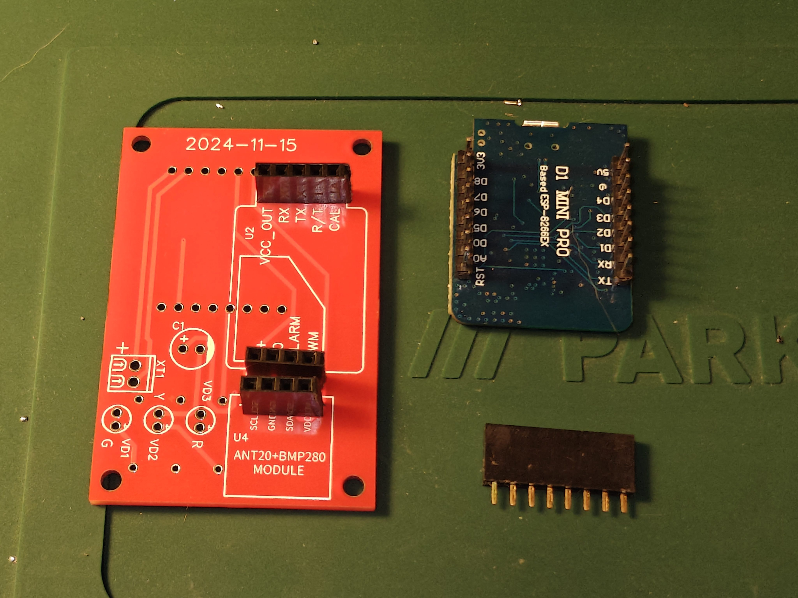
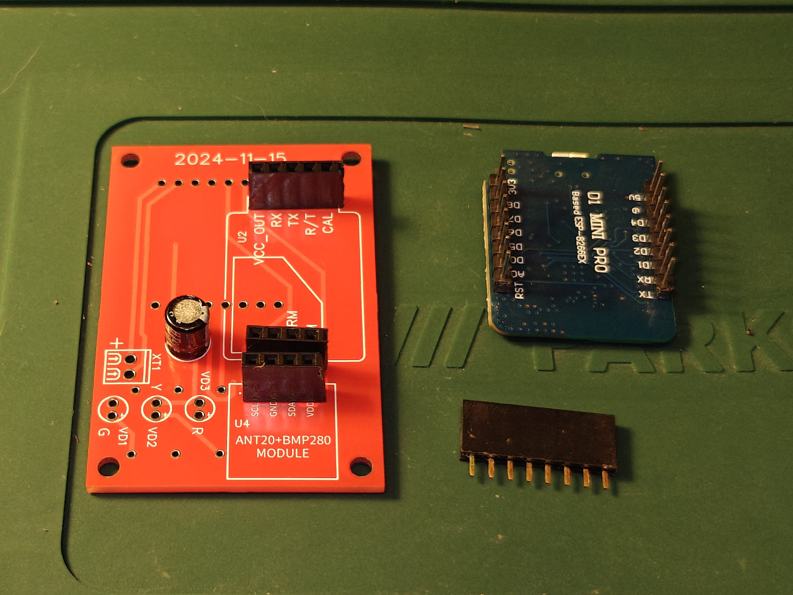
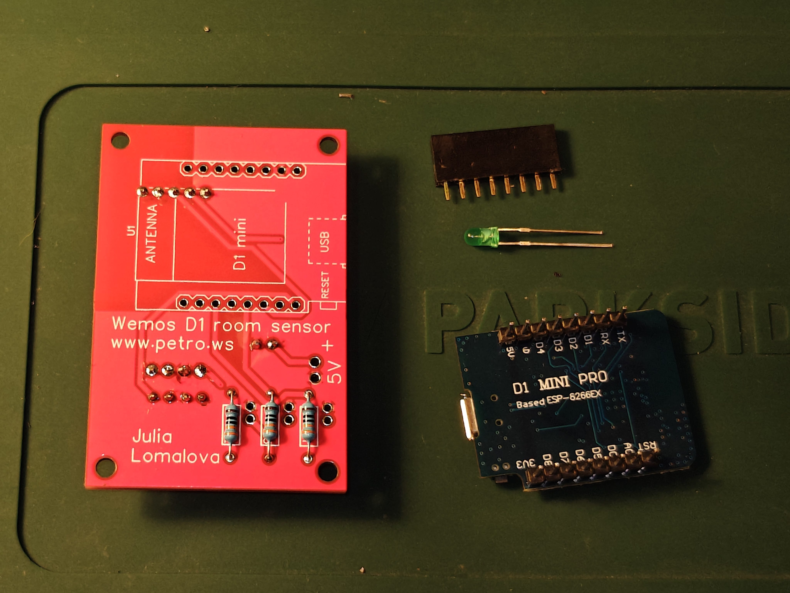
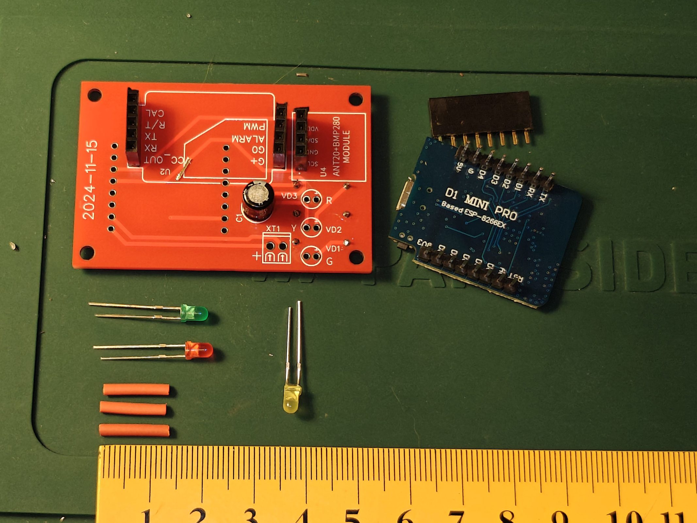
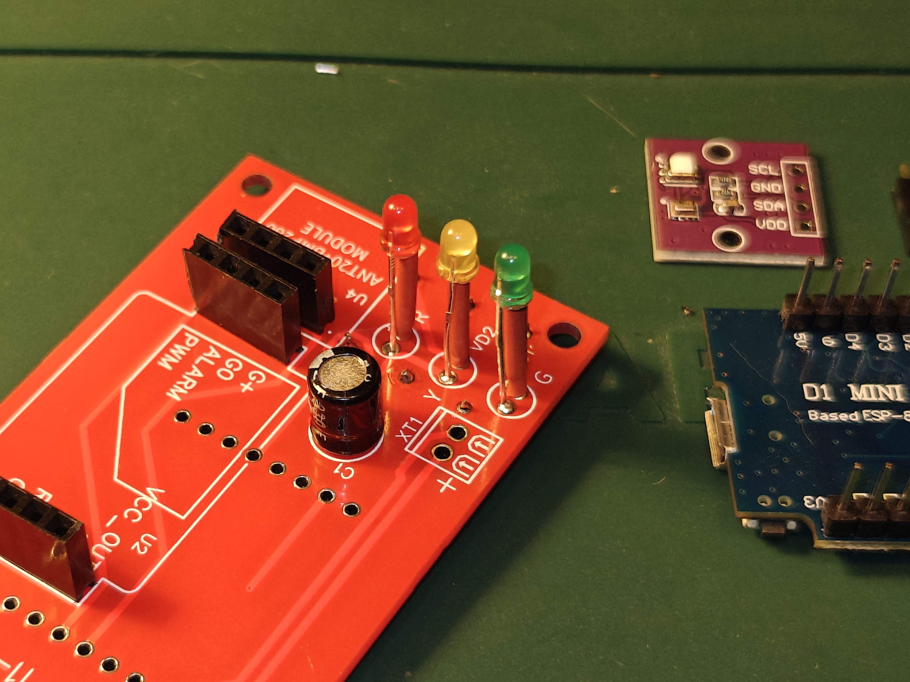
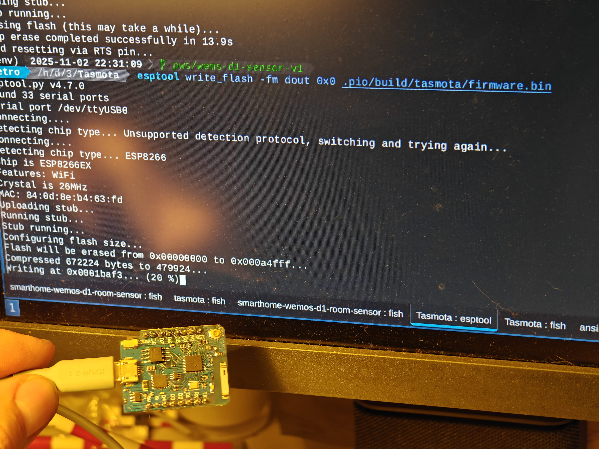
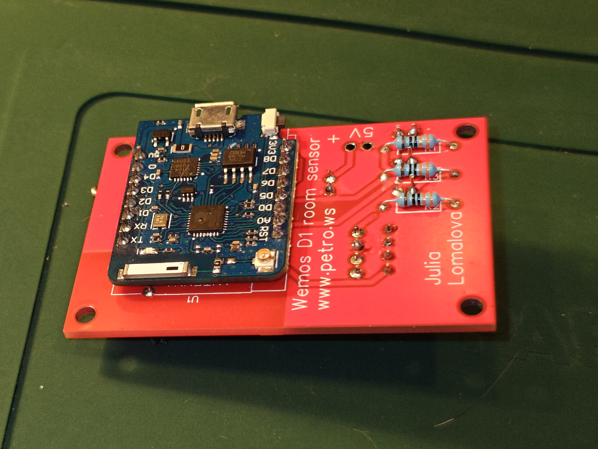
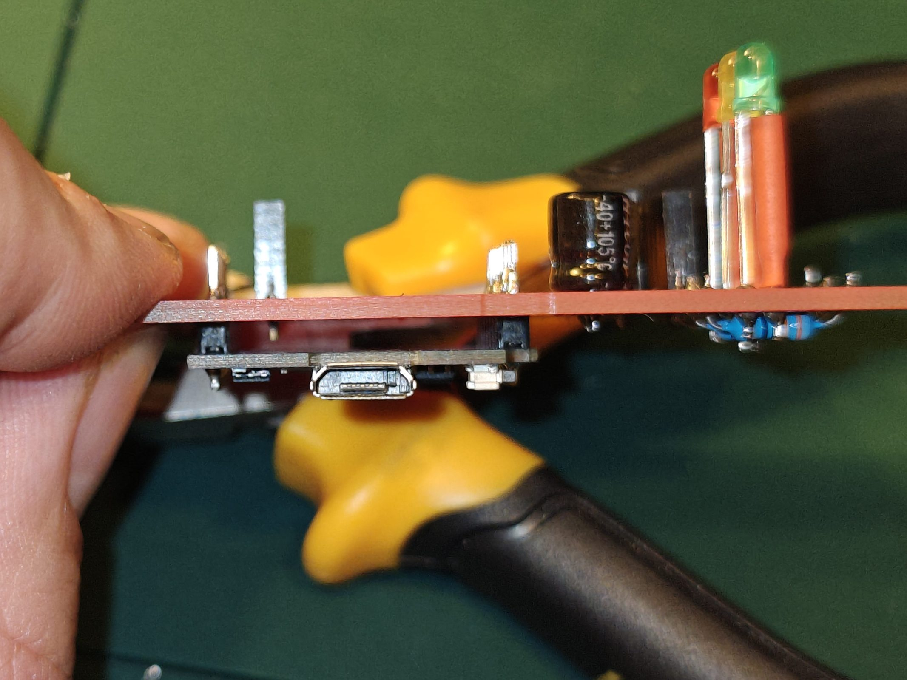
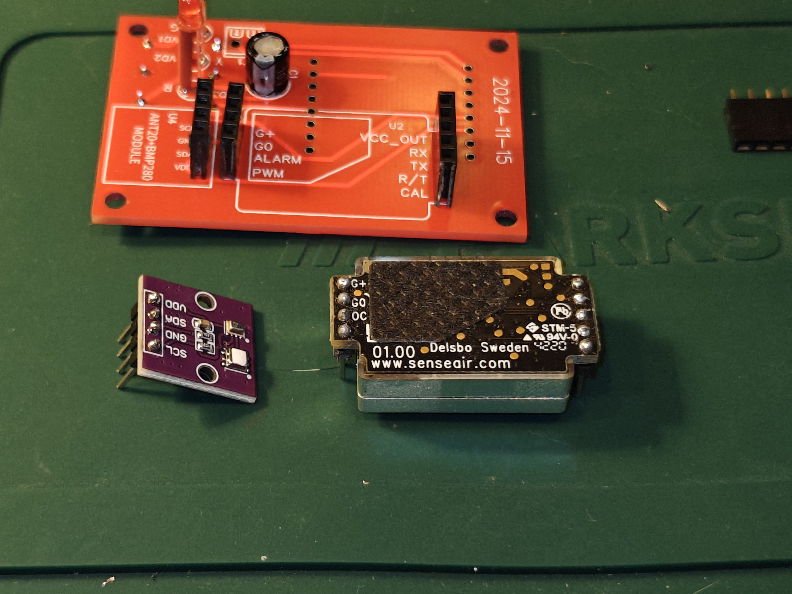
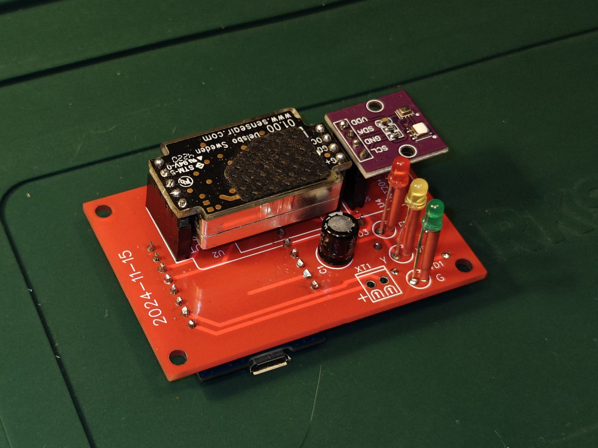

# Assembly instructions

First, prepare what you need:

## PCB passive components assembly

First of all, select *female* pinheads and cut off them to: 2x 4-pin and 1x 5-pin.

Solder them to marked places into S8 and ANT20 modules as folows:

**WARNING**: Test your solder quality with tester! Futher fixes will be hard to do, as solder points will be covered by MCU on next steps!

Install capacitor on the marked place:

Install LED limiting resisors on the marked place:

Prepare LED's. To use within provided case, they have to be with 13 mm offcet from board. One of possible way to fit this distance: cut off the isolation tube in advance, and use it on install:

Using isolation tube is optional, you can solder LED's directly, but this makes installation easier:

## MCU module

It is time to prepare your MCU!

Solder the *male* pinheads, usially included with Wemos D1. Then it is recommended to upload and test firmware:

It is important to have MCU tested, before it is soldered. Futher replacement will be hard.

Upon tested, solder MCU on the board, using double-side *male* pinheads.

Check that there is nothing contacts between board and MCU:

MCU installation is done.

## Final assembly

Solder pinheads on sensors (if you dont have them preinstalled). Avare of the right orientation of board side:

SenseAir S8 **must** be oriented with covered hole and PCB up. Recheck and install modules on board:

Device is complete! Please enjoy :-)
