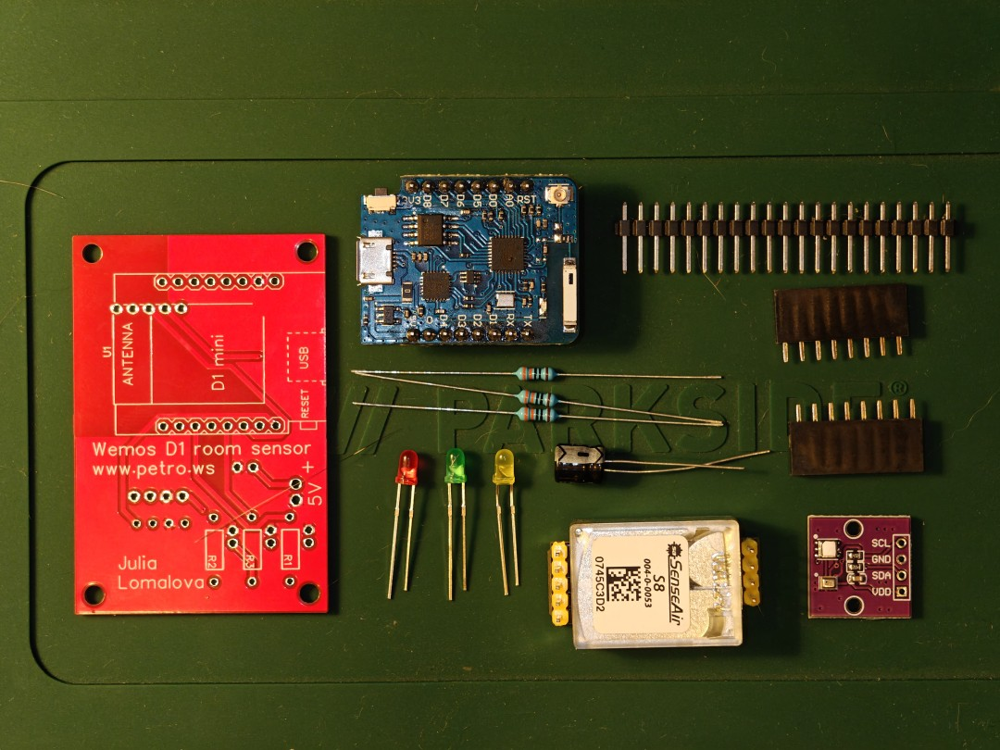
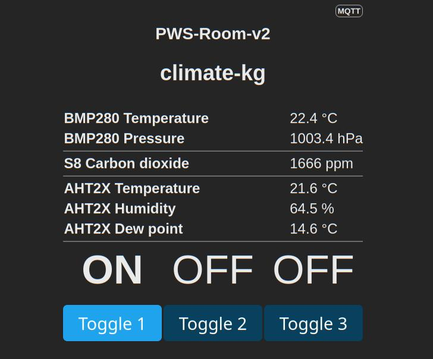

# GALOPED: Simple room sensor, Tasmota-ready


This project designed to provide some simple-to-repeat, WiFi DIY sensor with features:

* Telemetry to Smarthome systems: CO2 level, Temperature, Humidity and Pressure
* Runs Tasmota out-of-the-box, no DIY firmware required, all Tasmota features are on place (WebUI, MQTT, etc)
* Uses cheap Wemos-D1 board as CPU and WiFi
* Do not require SMD components installation, can be assembled with regural solder
* Simple construction, can be used as learning project
* Powered by USB from module (you can use variants with USB-C or Mini USB)
* Optional external power via terminal block
* Uses hi-precision climate sensor module
* Has three LED's, can bu used to display current CO2 level, as well as for any other purpose

## Assembly

What you need to build this device:



[Detailed assembly instructions](README.Assembly.md).

Required components are:

* PCB board (TBD), ~2€
* Wemos D1 mini / pro board. You can use any kind of this device, using USB-C or classical Mini-USB, [Aliexpress](https://de.aliexpress.com/item/1005001621784437.html), ~5€
* SenseAIR S8 device, original or any of its clones, [Aliexpress](https://de.aliexpress.com/item/1005004123170360.html), ~30€
* AHT20+BMP280 Temperature Humidity Air Pressure Module, [Aliexpress](https://de.aliexpress.com/item/1005005486181411.html), ~3€
* 330R wired resistors, 3 pcs, ~1€
* 3mm LED's, color on your with, 3 pcs, ~1€
* Electrolytic capacitor, suitable any rated 10+ V and 300+ Mf, ~1€
* Common 2.54mm pin headers: male and female, ~1€

Total components price: ~44€

All elements, except MCU and PCB borad are *optional*. Device can be also assembled as CO²-only or Temperature-only device, with and without indication, as well as bare MCU on board. Missing components will not prevent device to run normally, in case of missing components you will not get telemetry data.

**Board is designed to fit into standart 60x60 mm electric box**. I use it at my home to meausre outside temperature (CO² sensor and LED's are not installed).


## PCB Borad

Hardware project page: https://oshwlab.com/petrows/wemos-d1-room-sensor

PCB can be purchased directly from Project page.

## Firmware

Download here: https://github.com/petrows/smarthome-galoped/releases

Regarding flashing / config / recompile: see below

## Case

There is a case for 3D print provided. Files can be found under `3d-case` folder. Model published on [thingiverse.com website](https://www.thingiverse.com/thing:7191151).

> **WARNING**: to use this device within closed case, check and apply calibration. ESP and S8 sensors going warm during work, and it will affect tempterature sensor.

Recommended calibration for this case: `-4 C°`. To apply calibration, navigate to `Console` and type in command:

```
TempOffset -4
```

It is anyway recommended to calibrate your sensor, especially if purchasing some random components on Aliexpress.

## Led display level

LED's are actually GPIO's (connected as Relays in Tasmota), can be triggered via API / MQTT / etc as usial switches.

Provided firmware (see below) has rule activated by default. You may activate it by calling commands:

```
Rule1 "ON S8#CarbonDioxide<800 DO Power3 1 BREAK ON S8#CarbonDioxide<1500 DO Power2 1 BREAK ON S8#CarbonDioxide>0 DO Power1 1 ENDON"
Rule1 ON
```

This will enable fully offline LED indication. In default rules, they will display GREEN below 800, YELLOW below 1500 and RED otherwise. You can find and adjust this levels in `Rule1` command.

If you dont need this rule, you can deactivate it via:

```
Rule1 OFF
```

## Tasmota config

To configure module, you have to use custom firmware, as Tasmota has ANTx sensors support [disabled by default](https://tasmota.github.io/docs/AHT2x/).

Simple workflow to upload proper firmware:

```bash
wget https://petro.ws/s/tasmota-15.1.0-pws-module-v2.bin -O tasmota.bin
esptool erase_flash
esptool write_flash -fm dout 0x0 tasmota.bin
```

Then configure Tasmota as usial, by connecting to built-in WiFI AP.

Next step is to apply template. Navigate to `Configuration` » `Other`. There in `Template` section paste template:
```json
{"NAME":"PWS-Room-v2","GPIO":[1,1,1,1,608,640,1,1,224,1632,225,1600,226,1],"FLAG":0,"BASE":18,"CMND":"Interlock 1|WebButton1 R | WebButton2 Y | WebButton3 G | Rule1 ON"}
```
Enable `Activate` checkbox. Press `Save` to apply template.

Connect you sensors back and now you will see data from sensors read:



## Compile firmware

Prepare environment first.
Note: important to use same console, as it uses virtual environment activated.
All commands should be executed from repo root.

```bash
# Prepare Python env
python -m venv build/venv
source build/venv/bin/activate
# Install PlatformIO
pip install -U platformio
git clone https://github.com/arendst/Tasmota.git build/tasmota
```

Select release, what you want to use as a base:
```bash
cd build/tasmota
git checkout v15.1.0
```

Copy overrides config, where we have proper sensors enabled:
```bash
cp user_config_override.h build/tasmota/tasmota/
```

Now you can compile firmware. Replace upload port with your own:
```bash
cd build/tasmota
platformio run -e tasmota --target upload --upload-port /dev/ttyUSB0
```

Precompiled firmware can be found under `.pio/build/tasmota/firmware.bin`.

Precompiled firmwares could be found here: https://github.com/petrows/smarthome-galoped/releases